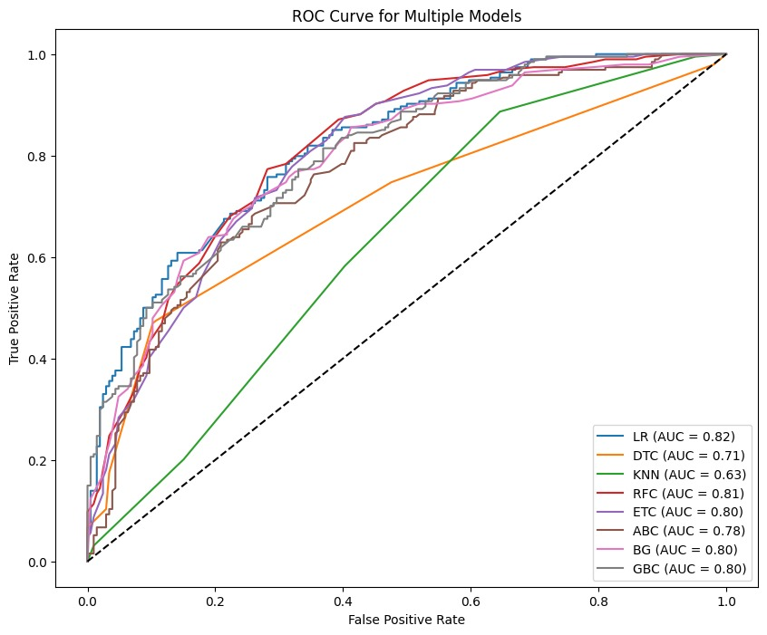
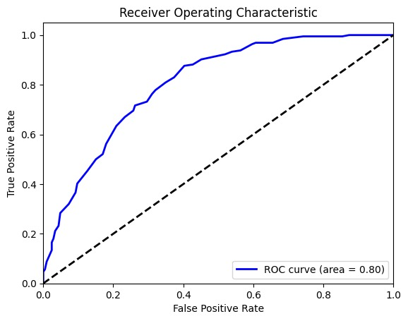

# 39_PAA_01

Here we are working on ps 1 which is 'AI content Authenticity challenge' .
steps followed :

1. literature and research paper analysis.
2. Data extraction from kaggle
   dataset : chatgpt_paraphrases.csv (https://www.kaggle.com/code/naifislam/differentiating-text-generated-from-human-and-ai/input?select=chatgpt_paraphrases.csv)

3. Data preprocessing:
   1. Vectorizing text using TfidfVectorizer
   2. converting output of TfidfVectorizer to array , that can be given to model
4. Using sklearn model Logistic regressor, Decision tree classifier , Extra tree classifier , etc.

5. Fitting all the processed data to above models

6. started making new Model through keras .

7. Fit train data to new model.

8. currently working on the new model for optimization.
9. new changes
